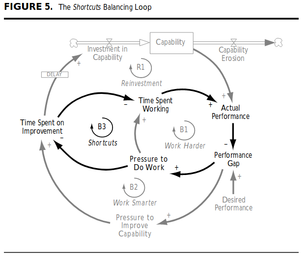

# Outubro/19

## [How Rust Makes Error Handling Part of the Language](http://patshaughnessy.net/2019/10/3/how-rust-makes-error-handling-part-of-the-language)

_06/10/2019 - Pat Shaughnessy_

Depois de um tempo estudando Rust e incorporando sua linguagem de tratamento de erros eu percebi que tratar erros faz parte de qualquer software, e que não ter o vocabulário para falar disso limitava minha consideração sobre o assunto.

Em Ruby não há uma forma dominante de tratar erros, e em geral os erros são ou ignorados ou presentes em alguns casos críticos. Mas tendo o vocabulário que adquiri com Rust comecei a identificar várias situações que erros podem acontecer e ficar desconfortável em não lidar com eles. [dry-monads](https://dry-rb.org/gems/dry-monads/master/) tem sido minha gem favorita pra colocar Result types em Ruby.

## [17 Reasons NOT To Be A Manager](https://charity.wtf/2019/09/08/reasons-not-to-be-a-manager/)

_10/10/2019 - Charity Majors_

Gestão é outra carreira. Não é tão fácil trocar de emprego como em desenvolvimento; tem que lidar com o bicho peculiar que é o ser dev; conversas difíceis; fazer indiretamente, não dá pra ter a ideia e executar, tem que influenciar; tem que levar a culpa por coisas que dão errado; toma tempo pessoal; toma as energias.

Muitas das coisas que parecem ser atribuídas à gestão podem ser feitas sem ter esse cargo. Mentoria, treinamento, liderança, decisões, feedback, etc. E não vale seguir a carreira de gestão por causa dessas coisas, é uma ilusão do pior tipo, a que engana a si mesmo.

## [The most common mistakes when using React](https://dev.to/clarity89/the-most-common-mistakes-when-using-react-45h2)

_11/10/2019 - clarity89, dev.to_

Os erros comuns listados são coisas que dá pra fazer, e que parece certo até fazer. Por exemplo mudar o estado diretamente ou assumir que atualizar o estado é síncrono. Não tem nada na API que dificulte esse tipo de interação. Precisa conhecer detalhes da implementação pra entender se algo não funcionar como esperado. É a abstração deixando algo passar.

Serve como lembrete que fazer APIs é difícil, não é apenas resolver um problema técnico complexo, mas também encontrar jeitos pra que a API seja usada corretamente.

## [The 5 mistakes you’re likely making in your one-on-one meetings with direct reports](https://knowyourteam.com/blog/2019/10/10/the-5-mistakes-youre-making-in-your-one-on-one-meetings-with-direct-reports)

_14/10/2019 - Claire Lew, Know Your Team_

Os cinco erros listados são: reagendar, fazer o 1:1 ser status report, não se preparar, não pedir input nos assuntos, perguntar "Como posso ajudar?".

Esse último erro é o detalhe que passa por boa intenção mas na realidade é deixar de fazer o próprio trabalho.

## [Nobody Ever Gets Credit for Fixing Problems that Never Happened](http://web.mit.edu/nelsonr/www/Repenning=Sterman_CMR_su01_.pdf)

_20/10/2019 - Nelson P. Repenning, John D. Sterman, paper 25 páginas, 2001_

Para lidar com problemas de produtividade as empresas adotam dois caminhos: trabalho duro ou trabalho inteligente.

A necessidade de melhorar performance acaba levando à adoção de programas de melhorias, que é uma tentativa de trabalho inteligente. Mas como há um atraso entre adoção e resultado, essas iniciativas são consideradas como falhas e eventualmente substiuídas por outras com a mesma ideia mas um nome diferente. Ou então mudam para controle total e exigências maiores sobre os funcionários.

O diferencial da gestão não é mais identificar oportunidades de melhoria e conhecer soluções, mas implementar essas soluções com sucesso.

Os ciclos de feedback de um sistema produtivo:

* **trabalho duro \(B1\)**: baixa performance leva à pressão para trabalhar mais, que leva à mais horas trabalhadas, que aumenta a produção. Tempo para feedback é curto, há limite do quanto se pode trabalhar mais, os ganhos param quando param as horas extra.
* **trabalho inteligente \(B2\)**: baixa performance leva à pressão para melhoria dos processos, que leva à mais tempo investido em melhorias. Imediatamente há uma queda de produção porque parte do tempo de trabalho é usado em investimentos. Há um atraso até o investimento se converter em aumento de produtivdidade, mas seu efeito é permanente.
* **atalhos \(B3\)**: um atalho aconetce quando o trabalho duro desvia tempo em investimento para tempo em produção. Isso forma um ciclo vicioso que elimina os efeitos do trabalho inteligente. Essa é a armadilha da capacitação.

_Fundamental attribution error_

Processo ruim leva à produção baixa. Pressão da gestão leva à horas extras que traz algum aumento de produção. A gestão passa a crer que o problema são os funcionários, não o processo.

_Superstitious learning_

Pressao da gestão para aumetnar tempo produtivo dos funcionários, estes aceitam a pressão e otimizam ao máximo a rotina e conseguem 30%, por exemplo, da meta de melhoria, para alcançar os outros 70% cortam tempo de investimento, ou sejam, pegam o atalho.

A gestão, inconsciente da presença do atalho, acredita que a pressão para aumentar o tempo produtivo teve o efeito total, corrigindo a disciplina dos funcionários. Mas, além de não ter aprendido a real causa da baixa proutividade, ficou também o aprendizado falso que a culpa é dos funcionários e que a pressão funciona. A recente perda de investimento em processos vai garantir a queda futura de produção.

Essa crença que produção baixa é falta de disciplina dos funcionários e o atraso entre melhorias no processo e resultado na produtividade contribuem bastante para a falha dos programas de melhoria. Durante a implantação das melhorias as metas de produção são mantidas, que leva a uma sobrecarga dos funcionários: adaptação ao novo sistema e manter a produção leva aos atalhos.

Quando a gestão descobre a existência dos atalhos há confirmação que os funcionários não podem ser confiados, assim há mais pressão por disciplina. Do lado dos funcionários há o aprendizado que é melhor esconder os problemas até ter a solução.

Assim começa uma cultura de apagar incêndios que recompansa heróis que resolvem prolemas de última hora sobre aqueles que tentam evitá-los em primeiro lugar. "Ninguém leva crédito por corrigir problemas que nunca aconteceram." Uma cultura de curto prazo.

Para alcançar sucesso nas iniciativas de melhoria e produtividade é necessária uma mudança de mentalidade: tirar o foco de culpados quando resolver um problema e simplesmente resolver o problema.

## [Intro to Empirical Software Engineering: What We Know We Don't Know](https://www.youtube.com/watch?v=WELBnE33dpY)

_21/10/2019 - Hillel Wayne, talk 37 min, GOTO 2019_

O título diz tudo, na prática do desenvolvimento de software ainda não sabemos o que não sabemos. Muito do que se diz é só opinião sem base científica, há pouca certeza dos melhores jeitos de se fazer software e muito menos das causas disso.

Ou seja, quase tudo de desenvolvimento é opinião ou anedota.

## [Don't Think of a White Bear](https://www.happinesslab.fm/episodes/dont-think-of-a-white-bear)

_23/10/2019 - Dr. Laurie Santos, podcast 42min, Happiness Lab_

Pensar no que não fazer é um jeito dessa coisa acontecer. Falar dos traumas é um jeito de se livrar dessa dor.

No final, um ensinamento do budismo, as duas flechas: a primeira causa dor, são as coisas ruins, não dá pra evitar pra sempre; a segunda é a reação à dor, essa dá pra controlar, é opcional.

